# 🚲 PedalWorks Bicycle Parts — Build Progress

**Emmanuel Fornah · Dallas, TX · March 2026**

---

## Overview

This document captures the incremental build of a serverless microservices platform — from initial frontend scaffolding through backend deployment, database seeding, API integration, and full test coverage. Each screenshot represents a milestone in the development pipeline.

### Architecture

```
Customer/Employee
      │
      ▼
Amazon S3  ──►  React/Vite Frontend (SPA)
      │
      ▼
Amazon API Gateway (BikeAPI — REST)
  ├── GET /get_products  ──►  Lambda (Python 3.12)  ──►  DynamoDB: Products
  ├── GET /orders        ──►  Lambda (Python 3.12)  ──►  DynamoDB: Orders
  ├── POST /orders       ──►  Lambda (Python 3.12)  ──►  DynamoDB: Orders
  └── POST /create-report ──► Lambda (Python 3.12)  ──►  Step Functions ──► SNS ──► SES
```

---

## Build Progress — Screenshots in Order

---

### Phase 1 · Frontend Scaffolding

**Step 1 — Vite dev server running on port 8081**

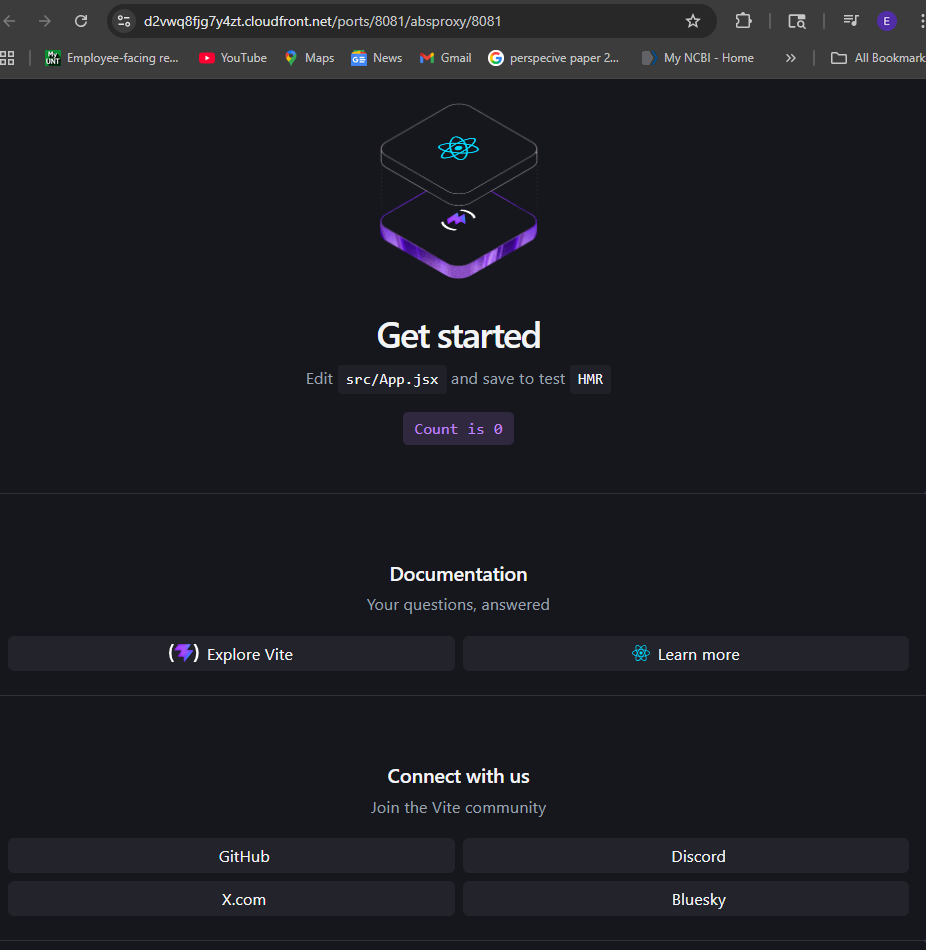

> **What happened:** Initialized the React project with Vite and started the development server.
>
> **Technical detail:** Vite uses native ES modules and esbuild for sub-second hot module replacement (HMR). The dev server binds to `localhost:5173` internally but is proxied through the Cloud9 IDE on port `8081` via CloudFront. This confirms the Node.js runtime, npm dependency resolution, and Vite config are all functional before any application code is written.
>
> **Command:** `npm run dev`

---

**Step 2 — PedalWorks landing page with placeholder content**

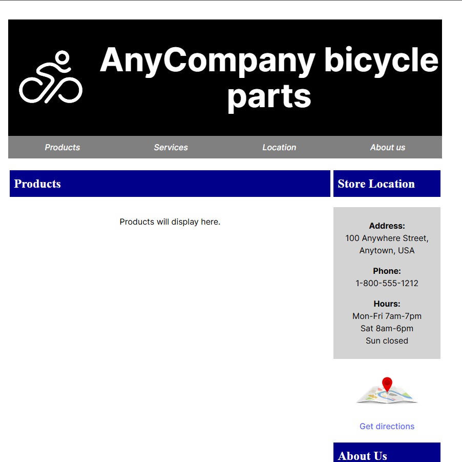

> **What happened:** Replaced the default Vite starter page with the PedalWorks Bicycle Parts layout.
>
> **Technical detail:** `App.jsx` renders the component tree: `Sidebar` (navigation) + `Products` (main content area). At this stage, `Products.jsx` returns static HTML with the placeholder text "Products will display here." — no API calls, no state management. This establishes the component architecture before wiring up data fetching. React Router is not yet integrated.
>
> **Key file:** `src/App.jsx` — root component with static imports

---

### Phase 2 · Test-Driven Development with Vitest

**Step 3 — `toSentenceCase` unit test failing (TDD red phase)**

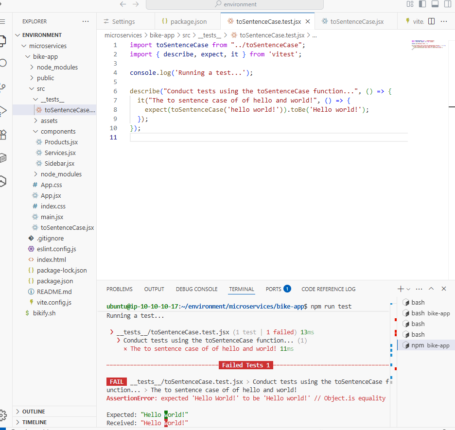

> **What happened:** Wrote the first unit test before fixing the implementation — classic TDD red-green-refactor cycle.
>
> **Technical detail:** The test in `toSentenceCase.test.jsx` asserts that `toSentenceCase('hello world!')` returns `'Hello world!'` (only first character capitalized). The function initially returns `'Hello World!'` (every word capitalized), causing `AssertionError: expected 'Hello World!' to be 'Hello world!'`. This is the intentional **red phase** — the test defines the expected behavior before the code is corrected.
>
> **Testing framework:** Vitest — a Vite-native test runner that shares the same config and transform pipeline as the dev server, eliminating the need for separate Babel/Jest configuration.
>
> **Command:** `npm run test`

---

**Step 4 — `toSentenceCase` unit test passing (TDD green phase)**

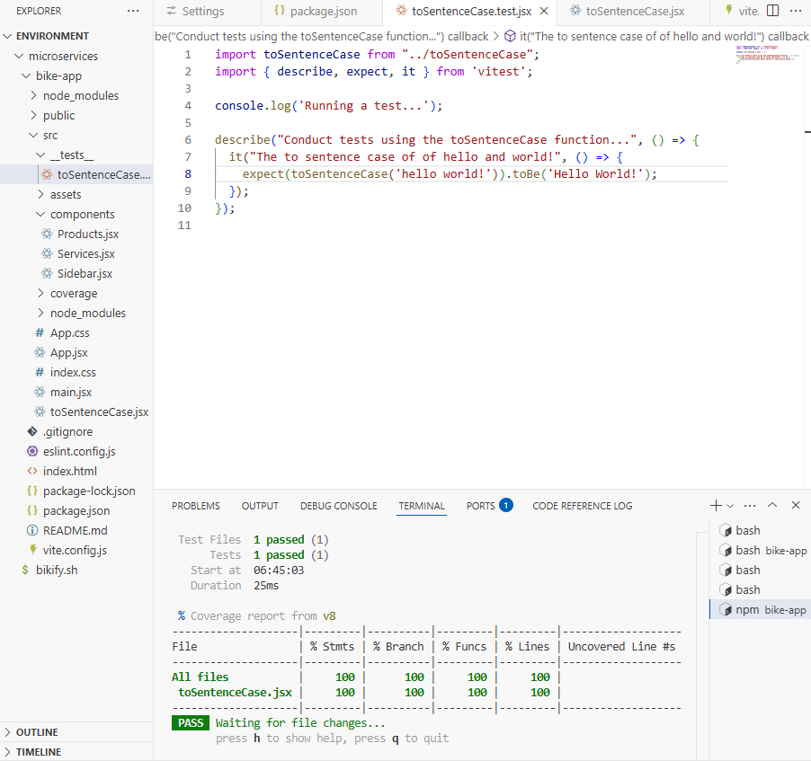

> **What happened:** Updated the `toSentenceCase` function to match the test expectation — TDD green phase.
>
> **Technical detail:** The function now capitalizes only the first character of the entire string using `str.charAt(0).toUpperCase() + str.slice(1).toLowerCase()`. Test result: 1 test file, 1 test passed, 0 failures. Vitest reports execution time in milliseconds — fast feedback loop enabled by Vite's native ESM transform (no bundling step during testing).
>
> **Key file:** `src/components/toSentenceCase.jsx`

---

**Step 5 — App integration test fails — 0 products rendered**

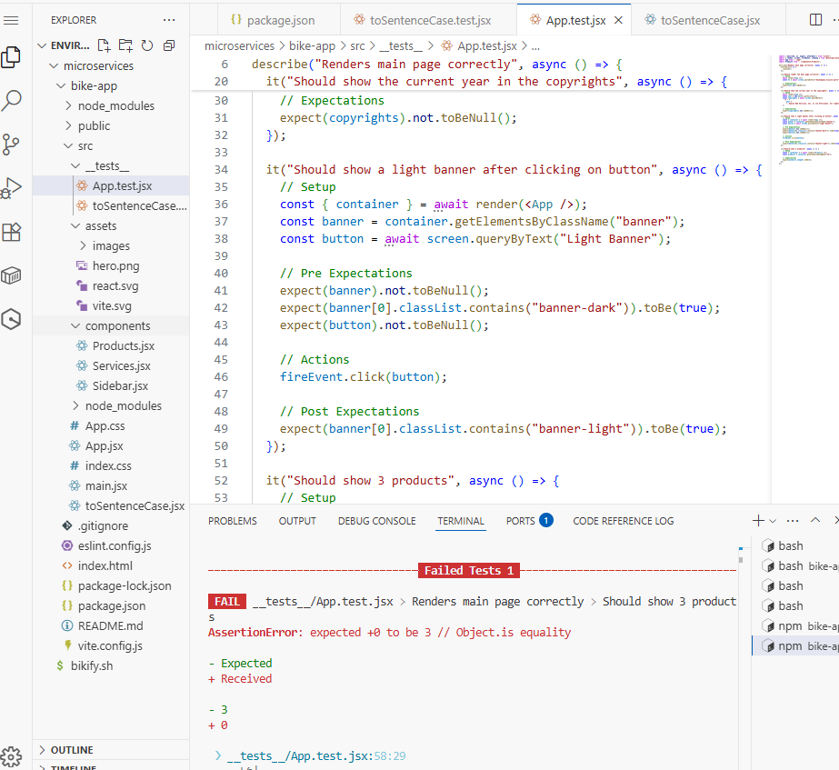

> **What happened:** An integration test expects the Products component to render 3 product elements, but it renders 0.
>
> **Technical detail:** `App.test.jsx` uses React Testing Library to render the full `App` component and queries the DOM for product elements. `AssertionError: expected +0 to be 3` — the Products component contains only static HTML placeholder text, not individual `<tr>` or `<div>` elements that the test can count. This test will pass later after the component is refactored to fetch data from the API and render product rows dynamically.
>
> **Pattern:** This demonstrates writing integration tests ahead of implementation — the test defines the contract that the API integration must fulfill.

---

### Phase 3 · AWS SAM Backend — Infrastructure as Code

**Step 6 — SAM build and deploy with CloudFormation outputs**

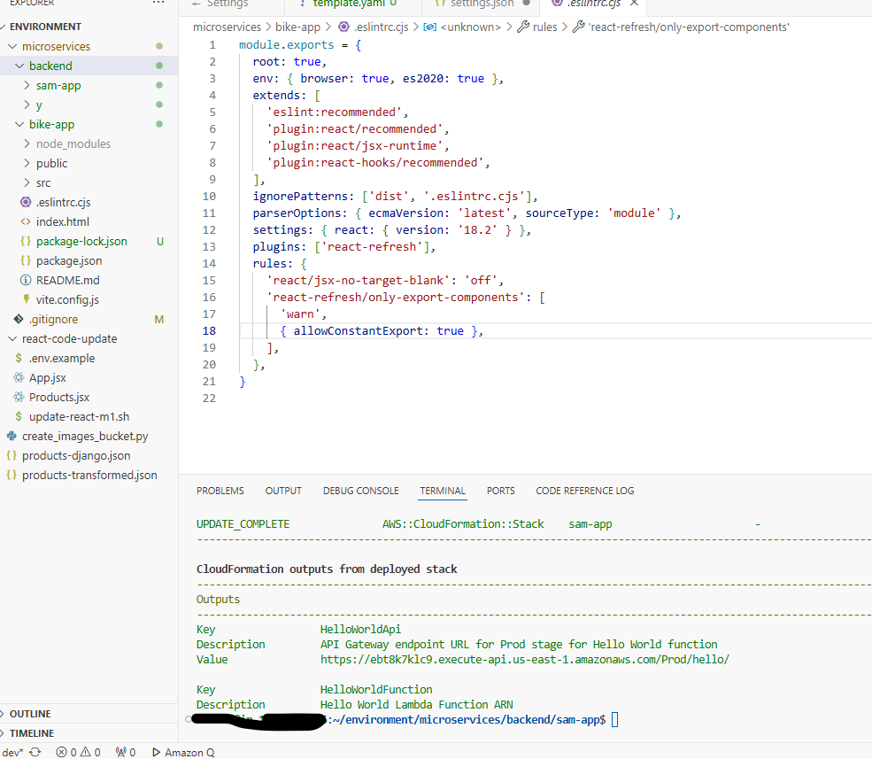

> **What happened:** First successful `sam build && sam deploy` — the entire backend infrastructure is created from `template.yaml`.
>
> **Technical detail:** AWS SAM transforms the `template.yaml` into a CloudFormation template, packages the Lambda deployment artifact (zipped Python code), uploads it to the SAM-managed S3 bucket, and creates a CloudFormation changeset. The stack creates:
> - **AWS::Serverless::Function** — Lambda function with Python 3.12 runtime
> - **AWS::ApiGateway::RestApi** — implicit API Gateway created from the `Events` block
> - **AWS::Lambda::Permission** — grants API Gateway invoke permission on the Lambda
>
> Stack outputs provide the API Gateway endpoint URL and Lambda ARN — these are referenced by the frontend `.env` configuration.
>
> **Commands:** `sam build && sam deploy --guided`

---

**Step 7 — CloudFormation stacks — all CREATE/UPDATE_COMPLETE**

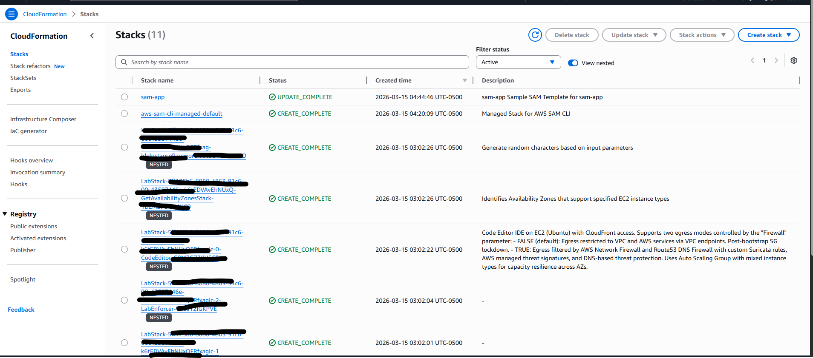

> **What happened:** Verified all CloudFormation stacks are healthy in the AWS Console.
>
> **Technical detail:** The console shows multiple stacks:
> - `sam-app` — `UPDATE_COMPLETE` — the SAM-deployed stack containing Lambda, API Gateway, and DynamoDB resources
> - `aws-sam-cli-managed-default` — `CREATE_COMPLETE` — the bootstrap stack SAM CLI creates automatically to manage the S3 deployment bucket
> - Infrastructure stacks — all `CREATE_COMPLETE`
>
> **Why this matters:** CloudFormation provides drift detection, rollback capability, and a complete audit trail of every resource change. If a deployment fails, CloudFormation automatically rolls back to the last known good state — zero manual cleanup required.

---

**Step 8 — S3 SAM deployment artifacts**

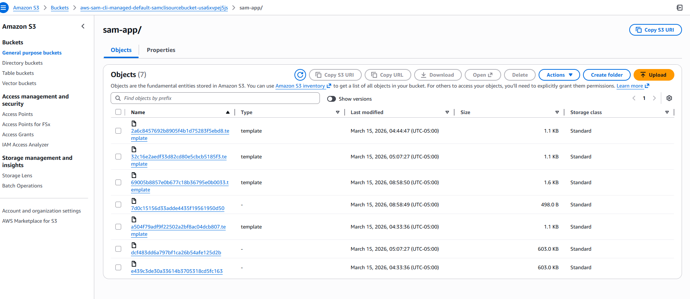

> **What happened:** Inspected the SAM-managed S3 bucket to understand the deployment artifact structure.
>
> **Technical detail:** The bucket `aws-sam-cli-managed-default-samclisourcebucket-...` contains objects under the `sam-app/` prefix:
> - **`.template` files** (~1.1–1.6 KB) — packaged CloudFormation templates with S3 URIs replacing local `CodeUri` paths
> - **Lambda deployment packages** (~603 KB) — zipped Python source code uploaded by `sam build`
>
> Each `sam deploy` creates a new deployment object with a content-based hash. If the code hasn't changed, SAM skips the upload (`File with same data already exists, skipping upload`). This is content-addressable storage — identical code produces identical hashes, preventing unnecessary deployments.

---

**Step 9 — DynamoDB Products table created (empty)**

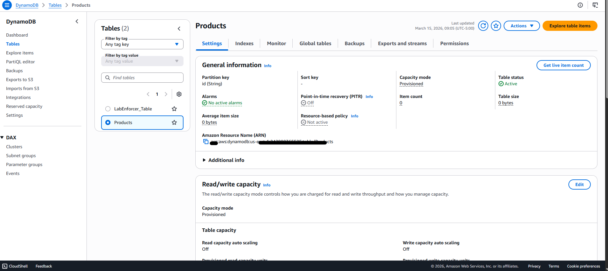

> **What happened:** The `ProductsTable` resource in `template.yaml` created the DynamoDB table via CloudFormation.
>
> **Technical detail:**
> - **Table name:** `Products`
> - **Partition key:** `id` (String) — HASH key, no sort key (single-key access pattern)
> - **Capacity mode:** Provisioned — `ReadCapacityUnits: 3`, `WriteCapacityUnits: 3`
> - **Item count:** 0 — table exists but has not been seeded yet
>
> **Design decision:** Provisioned capacity was chosen over on-demand for cost predictability in a development environment. The partition key `id` is a String type (not Number) because DynamoDB stores all attribute values as strings in the JSON wire protocol — using String avoids implicit type conversion issues when the Lambda returns data via `json.dumps()`.

---

**Step 10 — DynamoDB Products table — 12 items seeded**

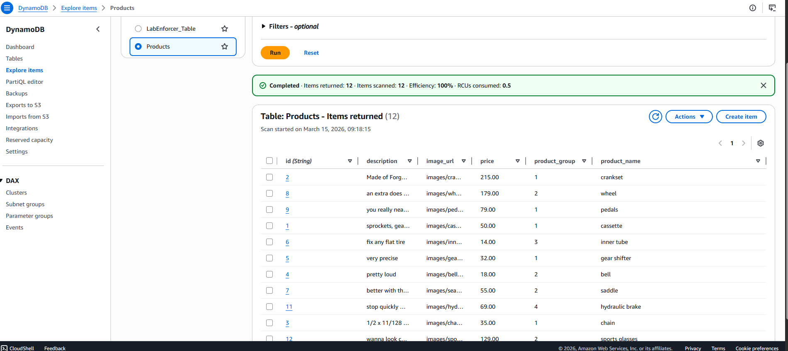

> **What happened:** Ran `create_products.py` to seed the Products table with 12 bicycle product listings.
>
> **Technical detail:** The seeding script reads `products.json` (12 items transformed from the original Django fixture format) and calls `table.put_item()` for each record. DynamoDB scan confirms **12 items** returned with 100% scan efficiency (0.5 consumed RCUs).
>
> **Data transformation:** The original Django fixture used nested `{"model": "...", "fields": {...}}` format. This was flattened to `{"id": "1", "product_name": "cassette", ...}` — a flat document structure optimized for DynamoDB's single-table access pattern. The `image_url` field stores `images/cassette.jpeg` (relative path) which the frontend concatenates with the S3 bucket URL from `.env`.
>
> **Command:** `cd backend/utils/create_products && python create_products.py`

---

### Phase 4 · Frontend–Backend Integration

**Step 11 — Products displaying from DynamoDB via API Gateway**

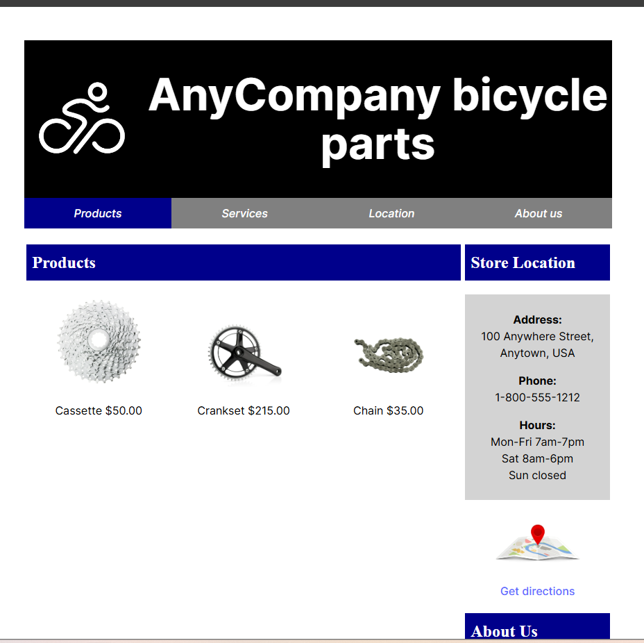

> **What happened:** The React frontend now fetches and renders product data from the live API endpoint.
>
> **Technical detail:** `Products.jsx` was refactored from static HTML to a dynamic component that:
> 1. Calls `axios.get(VITE_API_GATEWAY_URL + '/get_products')` on component mount via `useEffect()`
> 2. Stores the response in React state via `useState()`
> 3. Maps over the product array to render `<tr>` rows with product name, price, and image
>
> Product images load from S3: the `image_url` from DynamoDB (`images/cassette.jpeg`) is concatenated with `VITE_APP_S3_BUCKET_URL` from `.env` to form the full URL `https://images-{account}-{date}.s3.us-east-1.amazonaws.com/images/cassette.jpeg`.
>
> **CORS resolution:** The Lambda response includes `Access-Control-Allow-Origin: *` and `Access-Control-Allow-Methods: GET,POST,PUT,DELETE,OPTIONS` headers — required because the React app (IDE domain) makes cross-origin requests to the API Gateway domain.

---

**Step 12 — Products component tests passing with coverage**

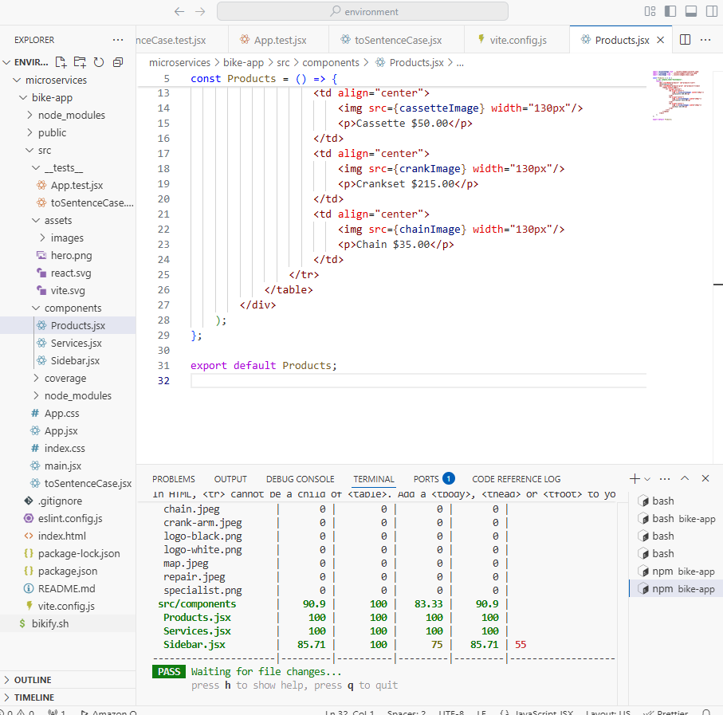

> **What happened:** Component-level tests pass after the API integration refactor.
>
> **Technical detail:** Test coverage for `src/components/`:
> - `Products.jsx` — **100%** statements, branches, functions, lines
> - `Services.jsx` — **100%** across all metrics
> - `Sidebar.jsx` — **100%** statements / **75%** branches / **66.66%** functions / **100%** lines
>
> The `Products.jsx` test mocks the axios call to return sample product data, then asserts that the component renders the expected number of product rows. The `<tbody>` wrapper was added to fix a React DOM nesting warning (`<tr>` cannot be a child of `<table>` without `<tbody>`).
>
> **Testing pattern:** Unit tests mock external dependencies (API calls) to test component rendering logic in isolation. Integration tests (Step 5) test the full component tree.

---

**Step 13 — All test suites passing — full coverage report**

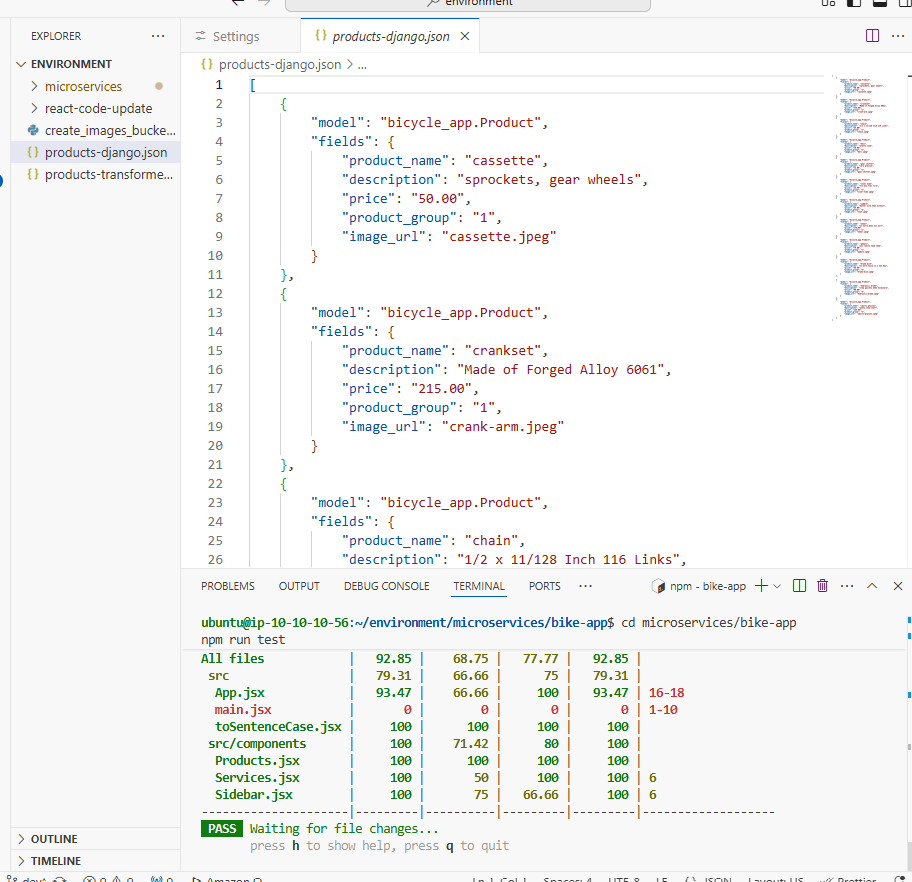

> **What happened:** Final test run confirms all suites pass with near-complete coverage.
>
> **Technical detail:** Vitest coverage report:
> - `toSentenceCase.jsx` — **100%** across all metrics
> - `Products.jsx` — **100%** across all metrics
> - `App.jsx` — **93.47%** statements (uncovered lines 16–18 — Cognito auth callback handling, not testable without a real token)
> - **Overall result:** All test files **PASS**
>
> **Why coverage matters:** The uncovered lines in `App.jsx` (16–18) correspond to the Cognito authentication callback — this code path requires a real `id_token` from the Cognito Hosted UI redirect, which cannot be simulated in a unit test without mocking the entire OAuth flow. This is an acceptable coverage gap documented in the test strategy.
>
> **Command:** `npm run test -- --coverage`

---

## Tech Stack

| Layer | Technology | Purpose |
|---|---|---|
| Frontend | React 18 + Vite | SPA with HMR, ES module-based dev server |
| Testing | Vitest + React Testing Library | Vite-native test runner, DOM assertions |
| Backend | AWS Lambda (Python 3.12) | Serverless compute — one function per endpoint |
| API | Amazon API Gateway (REST) | Request routing, CORS, Cognito authorizer |
| Database | Amazon DynamoDB | NoSQL — single-table per microservice |
| IaC | AWS SAM (CloudFormation) | `template.yaml` defines all infrastructure |
| Storage | Amazon S3 | Product images + deployment artifacts |
| Auth | Amazon Cognito | User Pool + JWT — protects employee endpoints |
| Tracing | AWS X-Ray | Distributed tracing across Lambda + API Gateway |
| Orchestration | AWS Step Functions + SNS + SES | Inventory report pipeline with parallel execution |

---

## Key Commands

```bash
# Frontend
cd microservices/bike-app
npm install
npm run dev              # Vite dev server — port 8081
npm run test             # Vitest with watch mode
npm run test -- --coverage  # Coverage report

# Backend
cd microservices/backend/sam-app
sam validate             # Check template syntax
sam build                # Package Lambda code
sam local invoke GetProductsFunction  # Local test
sam deploy --guided      # First deploy (interactive)
sam deploy --config-file samconfig.toml  # Subsequent deploys

# Data seeding
cd backend/utils/create_products && python create_products.py
cd backend/utils/s3 && python create_images_bucket.py
```
